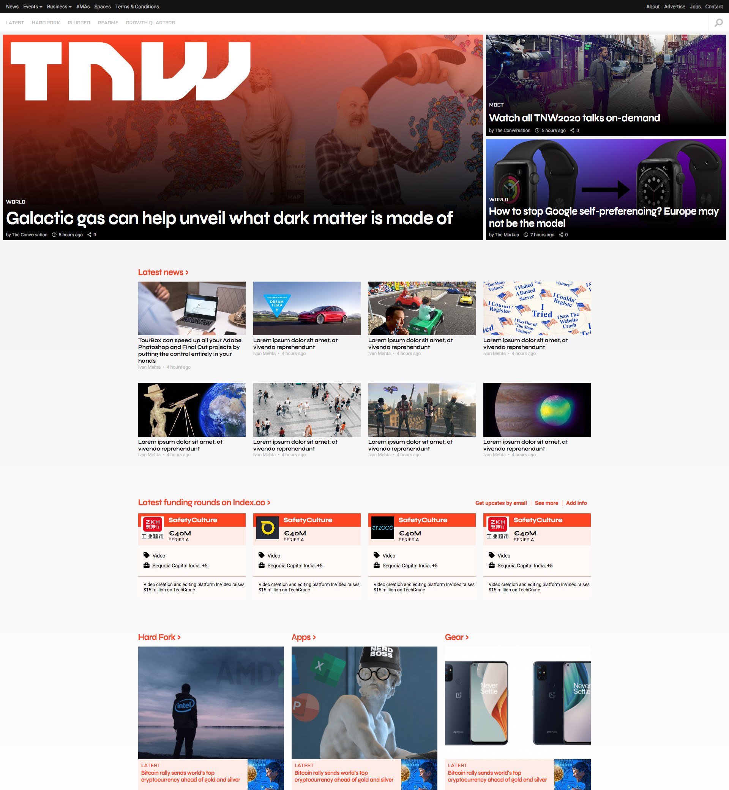

# Responsive Web Design Project: The Next Web

> This is a Clone of The Next Web site, where responsive, web design principles were applied.

In this project we used different responsive web design principles, such as media queries, responsive grids, flex-boxes, and a clear html outline.

Background image techniques were used to make the images responsive while keeping their aspect-ratio intact.

We applied a mobile first approach in the design, with 4 breakpoints in total.

**Website Screenshot:**

## Built With

- HTML
- CSS

## Live Demo

[Live Demo](https://starsheriff2.github.io/thenextweb-responsive-design-clone/)

## Authors

👤 **Arturo Alvarez**

- GitHub: [@StarSheriff2](https://github.com/StarSheriff2)
- Twitter: [@Turo_83](https://twitter.com/Turo_83)
- LinkedIn: [Arturo Alvarez](https://www.linkedin.com/in/arturoalvarezv/)

👤 **inser partner name here**

- GitHub: [@bAlejandroNo4](https://github.com/AlejandroNo4)
- LinkedIn: [Alejandro Contreras](https://www.linkedin.com/in/alejandro-contreras-rodriguez-b524821b5)

## Contributing

Contributions, issues, and feature requests are welcome!

Feel free to check the [issues page](inser issues page address here).

## Show your support

Give a ⭐️ if you like this project!
